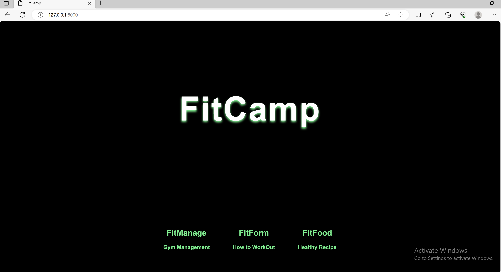
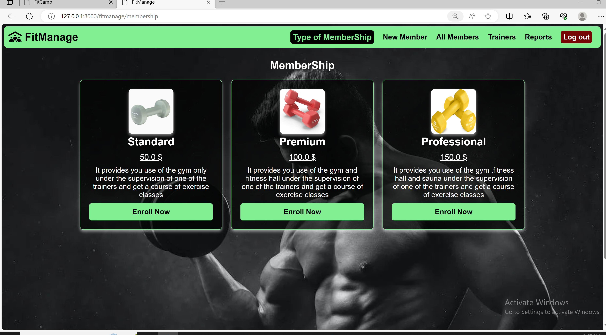
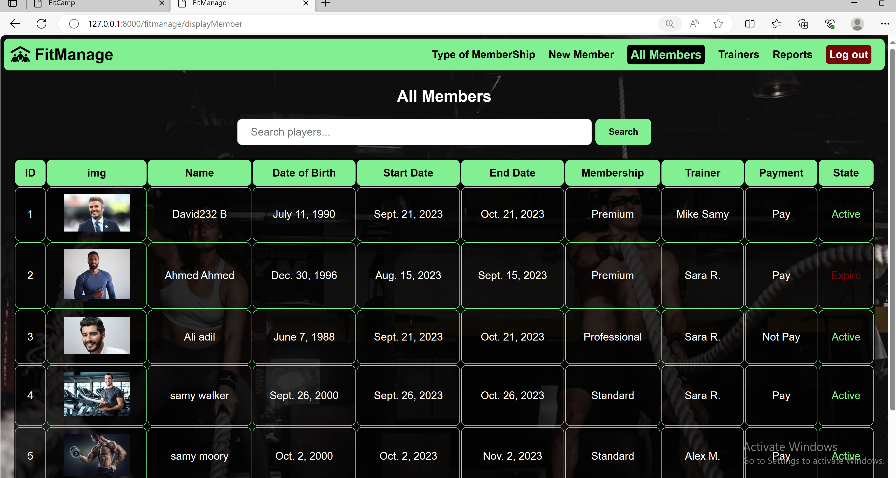
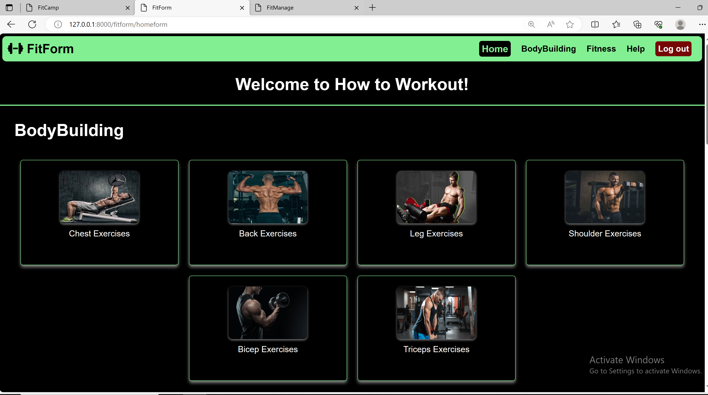
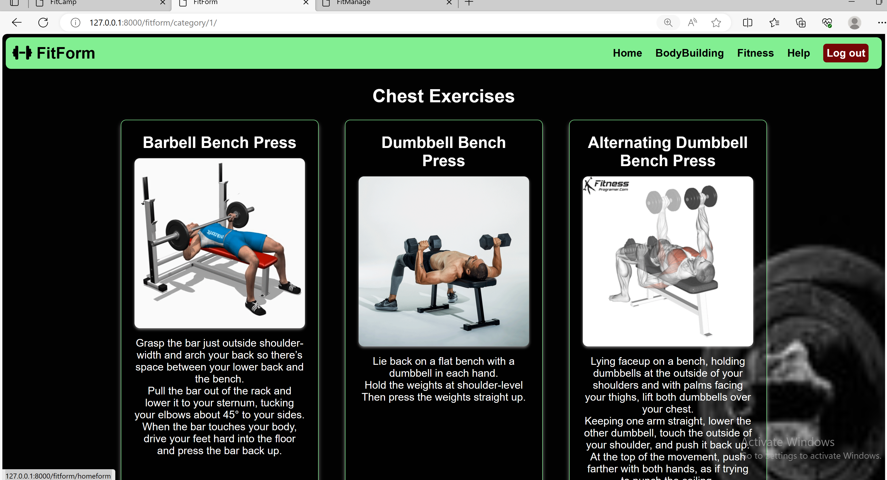
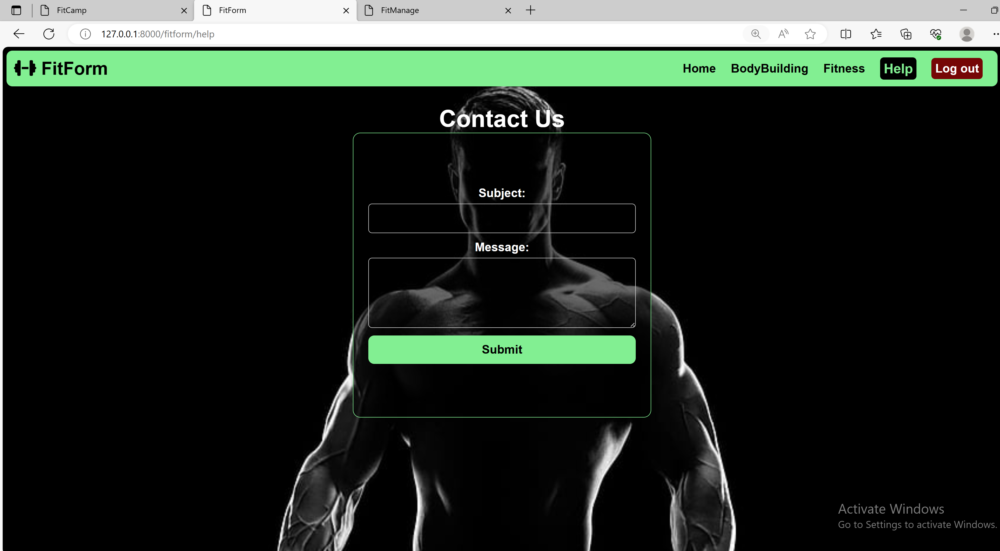
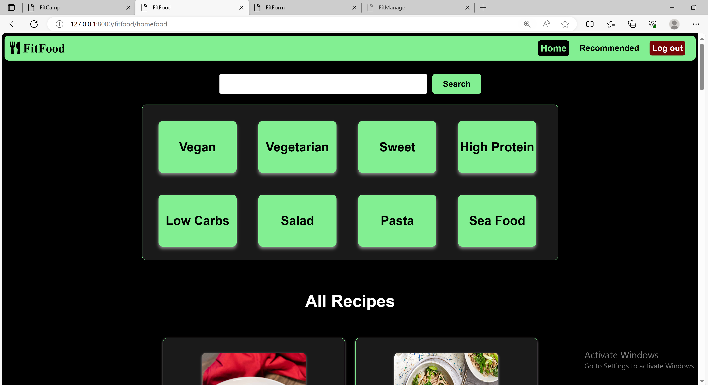
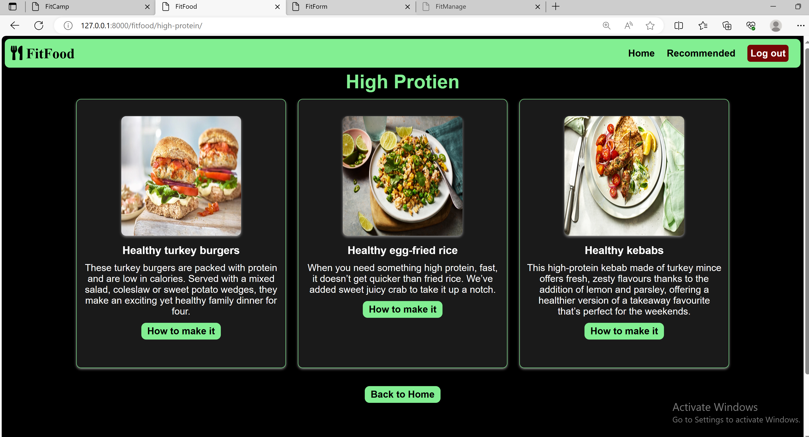

# FitCamp | CS50W-Capstone

</br>

### Overview

This WebSite is considered important for business, controlling the management of members and knowing their details, as well as issuing weekly reports, and also helping users understand exercises and how to apply them if they are exercises to build muscles or just for fitness, and also in terms of healthy nutrition and calculating the amount of calories and proteins in meals, so this application is considered comprehensive for all needs Gyms
and this project consider mutli-page build by Django framework with HTML , CSS and JavaScripts contains four apps **FitCamp** , **FitManage** , **FitForm** and **FitFood**

</br>

### Features

- Easy to use
- attractive  GUI
- Faster load speeds
- Reports for keeping track of payments

</br>

### Distinctiveness and Complexity

The complexity of this project was working on each app individually and then merging the apps in main app called **FitCamp** So this is something interesting , useful to work like that and The project utilizes Django (13 models) on the back-end in three apps **FitManage** , **FitForm** and **FitFood** and Javascript for the front-end , The WebSite is mobile-responsive as well, and I learned a lot in this project

:arrow_forward: &nbsp; **View Video Presenation [here](https://www.youtube.com/watch?v=gSWN1QJMPy0)**


## Installation & how to run the application

- Download the zip
- Extract the contents
- Install all dependencies by executing the following command:

```
pip install -r requirements.txt
```

- For running the application simply execute the following commands:

```
python manage.py migrate
python manage.py runserver
```


- For creating a user execute:

```
python manage.py createsuperuser
```

and then Follow the instructions


</br>

### FitCamp - main app

From this app, the user is able to move to one of the other apps


<div>


</div>


</br>

### FitManage - Gym Management

From this app the user has ability to manage the gym

<div>

</br>

</div>

## File Contents

### Front End

Contains CSS, JS, images, HTML files

- `static/manage/styles.css` - contain all CSS elements and mobile responsive design for this app
- ` templates/manage/layoutmanage.html ` - Layout page for FitManage app,
- ` templates/manage/loginmanage.html ` -  HTML template for login and signup
- ` templates/manage/registermanage.html ` - HTML template for Register
- ` templates/manage/indexmanage.html `  - HTML template for landing page
- ` templates/manage/membership.html ` - HTML template to show types of memberships offers
- ` templates/manage/addMember.html ` - HTML template to add new member with all detilas
- ` templates/manage/allMember.html ` -  HTML template to show all members in db
- ` templates/manage/trainers.html ` - HTML template for all trainers that app have in order to show them for members
- ` templates/manage/reports.html ` - HTML template for Export weekly reports

### Back End

Contains Views.py, Forms.py, Admin.py, URLS.py, Models.py files
The Models in the application are :

- `Type` - this model Hold the information about memberships like title , image ,price and detilas
- `Trainer` - this model Hold the information about the trainers that work in the gym and thier detials like name , image , specialist and evalution
- `AddMember` - this model Hold all detilas in order to add new members in db
- `WeeklyReport` - this model provide ability to export weekly reports about what happen in last week in the gym

</br>

### FitForm - How to WorkOut

From this app the user has ability to understand and apply all exercises

<div>

</br>
-
</br>

</div>

## File Contents

### Front End

Contains CSS, JS, images, HTML files

- `static/form/styles.css` - contain all CSS elements and mobile responsive design for this app
- ` templates/form/layoutform.html ` - Layout page for FitManage app
- ` templates/form/loginform.html ` -  HTML template for login and signup
- ` templates/form/registerform.html ` - HTML template for Register
- ` templates/form/indexform.html `  - HTML template for landing page
- ` templates/form/homeform.html `  - HTML template for Home page
- ` templates/form/body.html ` - HTML template to show main muscles exercise
- ` templates/form/category_exercises.html ` -  HTML template show all detials about   muscles exercise that the user click on it
- ` templates/form/fitness.html ` - HTML template to show all fitness exercise
- ` templates/form/fitness_details.html ` - HTML template to show detilas for fitness exercise
- ` templates/form/search_results.html `- HTML template to show the result search in body.html
- ` templates/form/search_fitness.html `- HTML template to show the result search in fitness.html
- ` templates/form/helpform.html `- HTML template to show the form if the user need help
- ` templates/form/recivedform.html ` - HTML template to show the confirm that message help received

### Back End

Contains Views.py, Forms.py, Admin.py, URLS.py, Models.py files
The Models in the application are :

- `WorkoutCategory` - this model Hold the name and image of exercise
- `Exercise` -  this model Hold all detials about the exercise
- `Fitness` - this model Hold all detials about fitness exercise
- `UserQuery` - this model Hold if the user has help or need something


</br>

### FitFood - Healthy Recipe

From this app the user has ability to learn how to prepare healthy food and know the calories

<div>


</br>


</div>

## File Contents

### Front End

Contains CSS, JS, images, HTML files

- `static/food/styles.css` - contain all CSS elements and mobile responsive design for this app
- ` templates/food/layoutfood.html ` - Layout page for FitManage app
- ` templates/food/loginfood.html ` -  HTML template for login and signup
- ` templates/food/registerfood.html ` - HTML template for Register
- ` templates/food/indexfood.html `  - HTML template for landing page
- ` templates/food/homefood.html `  - HTML template for Home page
- ` templates/food/recipe_detail.html ` - HTML template in order to show all detials about the recipe
- `templates/food/recommended.html` - HTML template for recommended the popular recipe
- other templates are **high protein** , **low_carbs** , **pasta** , **salad** ,**seafood** , **sweet** , **vegan** and **vegetarian** contains the main title and brief about the recipe and button how to make it 

### Back End

Contains Views.py, Forms.py, Admin.py, URLS.py, Models.py files
The Models in the application are :

- `Category` - this model Hold the name of Category like vegan or high proteinn
- `Ingredient` - this model Hold all ingredient about the recipes
- `Recipe` - this model Hold details of the recipes like title , category , ingredient , instructions and image of recipe
- `NutritionInfo` - this model Hold the NutritionInfo fact about the recipe like calories , protein , carbs and fat
- `Comment` - this model Hold comment that user leave it about recipe